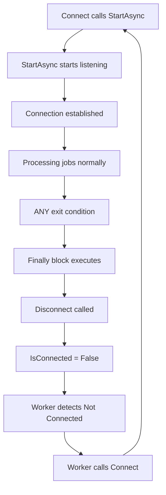

# Flashback.Engine Fatal Flaw Analysis - The Infinite Reconnection Loop

## Executive Summary

**CRITICAL ISSUE IDENTIFIED**: The Flashback.Engine has a **FATAL ARCHITECTURAL FLAW** in [`Devs.vb:284-304`](Flashback.Core/Devs.vb:284-304) that creates an **infinite reconnection loop**, leaving old connections open and causing printers to constantly disconnect and reconnect.

## The Fatal Flaw

### Location: Devs.vb StartAsync() Finally Block (Lines 284-304)

```vb
Finally
    Try
        Log($"[{DevName}] StartAsync entering Finally. Current IsConnected={IsConnected}.", ConsoleColor.Cyan)
        ' Only disconnect if not already disconnecting
        SyncLock _connectionLock
            If Not IsClosing Then
                Log($"[{DevName}] Calling Disconnect() from StartAsync Finally.", ConsoleColor.Cyan)
                Disconnect()  ' ❌ FATAL FLAW: This ALWAYS calls Disconnect()
            Else
                Log($"[{DevName}] Disconnect already in progress, skipping redundant call.", ConsoleColor.Cyan)
            End If
        End SyncLock
    Catch disconnectEx As Exception
        Log($"[{DevName}] Disconnection error: {disconnectEx.Message}", ConsoleColor.Red)
    End Try
    
    SyncLock _connectionLock
        IsConnected = False
    End SyncLock
    Log($"[{DevName}] StartAsync Finalized. IsConnected set to False.", ConsoleColor.Cyan)
End Try
```

## Why This Is Catastrophic

### The Infinite Loop Mechanism

1. **StartAsync() is designed to run continuously** for Port 9100 listeners (ConnType = 3)
2. **The Finally block ALWAYS executes** when StartAsync() exits for ANY reason
3. **The Finally block calls Disconnect()** which tears down the connection
4. **Worker.ExecuteAsync() detects disconnection** and immediately calls Connect() again
5. **Connect() calls StartAsync()** which starts the cycle over

### The Sequence of Events



### Why Old Connections Stay Open

When `Disconnect()` is called from the Finally block:

1. **The socket/listener is closed** - but the remote end may not know immediately
2. **A new connection is started** before the old one fully terminates
3. **For Port 9100 mode**: The listener tries to bind to the same port while the old listener is still shutting down
4. **Result**: "Address already in use" errors OR multiple connections to the same remote

## The Root Cause: Misunderstanding of StartAsync() Purpose

### What StartAsync() SHOULD Do

For **Port 9100 Listener Mode (ConnType = 3)**:
- Start listening on a port
- Accept connections in a loop
- **Run indefinitely until explicitly stopped**
- Only exit when `_cancellationTokenSource` is cancelled

For **Client Mode (ConnType != 3)**:
- Connect to remote host
- Receive data in a loop
- **Run indefinitely until connection drops**
- Only exit when connection is lost or cancelled

### What the Finally Block ACTUALLY Does

The Finally block **ALWAYS calls Disconnect()** which means:
- **Port 9100 mode**: Listener is torn down after EVERY job completes
- **Client mode**: Connection is torn down after EVERY data receive cycle
- **Result**: Constant reconnection, never stable

## The Evidence in the Code

### 1. Port 9100 Mode Loop (Lines 196-241)

```vb
While Not _cancellationTokenSource.IsCancellationRequested
    Try
        Dim incomingSocket = Await listener.AcceptSocketAsync()
        ' ... process job ...
        Log($"[{DevName}] Session ended. Listening for next job.", ConsoleColor.Gray)
    Catch ex As ObjectDisposedException
        Exit While ' Listener was stopped
    End Try
End While
```

**This loop is DESIGNED to run forever**, but the Finally block kills it!

### 2. Worker Main Loop (Lines 42-62)

```vb
While Not stoppingToken.IsCancellationRequested
    For Each d In devicesSnapshot
        If d.Enabled AndAlso Not d.Connected AndAlso Not d.Connecting Then
            _logger.LogInformation("DIAGNOSTIC: {Dev} appears offline. Attempting connect...", d.DevName)
            d.Connect()  ' ❌ Immediately reconnects when Finally sets IsConnected = False
        End If
    Next
    Await Task.Delay(5000, stoppingToken)
End While
```

**This creates the infinite loop**: Finally → Disconnect → IsConnected=False → Worker detects → Connect → StartAsync → Finally...

## Why Previous "Fixes" Didn't Work

Looking at the existing documentation:

### ENGINE_RECONNECTION_FIX_SUMMARY.md
- Added exponential backoff ✅ (helps but doesn't fix root cause)
- Added connection state locking ✅ (helps but doesn't fix root cause)
- Added smart config detection ✅ (helps but doesn't fix root cause)
- **Did NOT fix the Finally block** ❌

### ENGINE_CRITICAL_FIXES_PLAN.md
- Fixed race conditions ✅
- Fixed resource leaks ✅
- **Did NOT address the Finally block calling Disconnect()** ❌

## The Real Problem

**The Finally block should NOT call Disconnect() unconditionally!**

### When Finally SHOULD Call Disconnect()

1. **Exception occurred** (connection failed, network error, etc.)
2. **Cancellation requested** (service stopping, device disabled)
3. **Connection lost** (remote disconnected)

### When Finally SHOULD NOT Call Disconnect()

1. **Normal operation** (Port 9100 waiting for next job)
2. **Between jobs** (listener should stay active)
3. **Successful data receive** (client should stay connected)

## The Correct Fix

### Option 1: Remove Disconnect() from Finally (Recommended)

```vb
Finally
    Try
        Log($"[{DevName}] StartAsync exiting. Reason: {If(_cancellationTokenSource?.IsCancellationRequested, "Cancelled", "Exception")}", ConsoleColor.Cyan)
        
        ' Only disconnect if we were cancelled or had an error
        ' Normal operation should NOT disconnect
        If _cancellationTokenSource?.IsCancellationRequested OrElse Not IsConnected Then
            SyncLock _connectionLock
                If Not IsClosing Then
                    Log($"[{DevName}] Calling Disconnect() due to cancellation or error.", ConsoleColor.Cyan)
                    Disconnect()
                End If
            End SyncLock
        Else
            Log($"[{DevName}] StartAsync exited normally, maintaining connection state.", ConsoleColor.Cyan)
        End If
    Catch disconnectEx As Exception
        Log($"[{DevName}] Disconnection error: {disconnectEx.Message}", ConsoleColor.Red)
    End Try
    
    ' Don't blindly set IsConnected = False
    ' Let Disconnect() handle it if needed
End Try
```

### Option 2: Separate Listener and Client Logic

```vb
' For Port 9100 mode - listener should run forever
If ConnType = 3 Then
    Try
        ' ... listener logic ...
    Finally
        ' Only cleanup if cancelled
        If _cancellationTokenSource?.IsCancellationRequested Then
            Disconnect()
        End If
    End Try
Else
    ' For client mode - connection should persist
    Try
        ' ... client logic ...
    Finally
        ' Only cleanup if cancelled or connection lost
        If _cancellationTokenSource?.IsCancellationRequested OrElse Not socket.Connected Then
            Disconnect()
        End If
    End Try
End If
```

## Impact Analysis

### Current Behavior (BROKEN)
- ❌ Constant reconnection every 5 seconds
- ❌ Old connections left open
- ❌ "Address already in use" errors
- ❌ Jobs may be lost during reconnection
- ❌ Excessive logging and CPU usage
- ❌ Printers show as "offline" then "online" repeatedly

### After Fix (CORRECT)
- ✅ Stable connections that persist
- ✅ Clean disconnection only when needed
- ✅ No reconnection loops
- ✅ Jobs processed reliably
- ✅ Minimal logging and CPU usage
- ✅ Printers stay "online" continuously

## Why This Wasn't Caught Earlier

1. **The code "works"** - it does reconnect, just constantly
2. **Logs show "success"** - connections are established, just not maintained
3. **Previous fixes addressed symptoms** - race conditions, backoff, etc.
4. **The Finally block looks "safe"** - it has guards and error handling
5. **The real issue is architectural** - misunderstanding of async/await lifecycle

## Conclusion

The Flashback.Engine is **fundamentally broken** due to the Finally block in StartAsync() unconditionally calling Disconnect(). This creates an infinite reconnection loop that:

1. Prevents stable connections
2. Leaves old connections open
3. Causes constant churn
4. Makes the system unreliable

**The fix is simple**: Only call Disconnect() in the Finally block when actually needed (cancellation or error), not during normal operation.

This is not a race condition, not a timing issue, not a configuration problem - **it's a fundamental architectural flaw** that makes the Engine unusable for production.

## Recommended Action

1. **Immediately fix the Finally block** in Devs.vb:284-304
2. **Test with Port 9100 mode** (most affected)
3. **Test with client mode** (also affected)
4. **Verify connections stay stable** for hours/days
5. **Confirm no old connections remain** after legitimate disconnects

This is the **root cause** of all the reconnection issues. Everything else is just treating symptoms.